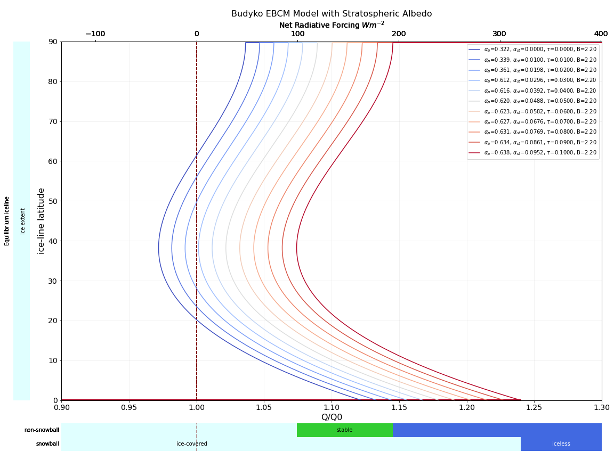

# A Budyko Model with Stratospheric Albedo

This notebook adapts the standard Budyko model (1969) to include the effects of Stratospheric Albedo. 

It uses Matplotlib's object oriented programming to progressively animate changes in the equilibrium solution.

The main result is depicted in the following image, where the sliders refer to the last run (at the optical depth $$\tau = 0.1$$).

